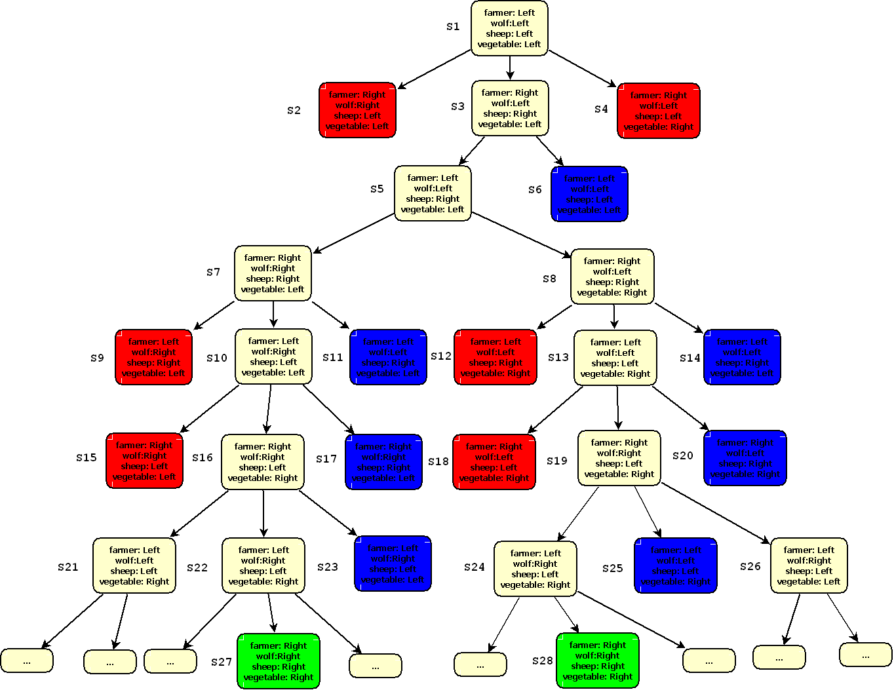

# 狼、羊、菜和农夫过河问题  算法思路

> 农夫需要把狼、羊、菜和自己运到河对岸去，只有农夫能够划船，而且船比较小，除农夫之外每次只能运一种东西，还有一个棘手的问题，就是如果没有农夫看着，羊会偷吃菜，狼会吃羊。请考虑一种方法，让农夫能够安全地安排这些东西和他自己过河。

## 算法设计思路



### 状态的数据模型
置定义 LOCATION 就是两个状态，LOCATION::LEFT 表示对应的元素在河的左岸，LOCATION::RIGHT 表示对应元素在河的右岸（就是过河状态）。

struct ItemState
```
{
......
  LOCATION farmer,wolf,sheep,vegetable; //四个元素的位置
  ACTION curAction; //此状态对应的动作
};
```

curAction 是当前状态绑定的过河动作，即前一个状态通过这个过河动作转变成当前状态。记录状态对应的过河动作的目的是能够在输出结果时，按照状态演变序列的顺序输出过河动作。
### 过河动作的数据模型

只有 8 个固定动作

* (1)农夫自己过河
* (2)农夫带狼过河
* (3)农夫带羊过河
* (4)农夫带菜过河
* (5)农夫自己返回
* (6)农夫带狼返回
* (7)农夫带羊返回
* (8)农夫带菜返回


搜索过程中对过河动作遍历的时候，要根据这些情况合理地剪掉一些分支

            num class ACTION
            {
                GO_SELF,
                GO_WITH_WOLF,
                GO_WITH_SHEEP,
                GO_WITH_VEGETABLE,
                BACK_SELF,
                BACK_WITH_WOLF,
                BACK_WITH_SHEEP,
                BACK_WITH_VEGETABLE,
            };
   
   
## 设计搜索算法
索算法依然采用深度优先遍历，从初始状态节点开始，一直搜索到合法状态为止，在这个过程中，需要记录已经搜索过的状态，避免出现重复状态导致算法进入死循环。

### 状态树的遍历

状态树的遍历就是促使状态树上的一个状态向下一个状态转换的驱动过程，这是一个很重要的部分，如果不能正确地驱动状态变化，就不能实现这个穷举算法，前面提到的动作模型，就是驱动状态变化的关键因子。

对于一个状态来说，它能转换到哪些新状态，取决于它能应用哪些过河动作，与此同时，不同的过河动作也会对状态产生不同的变化。

 8 个过河动作对状态的影响无法用一个一致的代码逻辑进行处理，所以我们为每个过河动作定义一个代码处理逻辑，8 个动作对应 8 个代码处理逻辑：
```
struct ActionProcess
{
    ACTION  act_name;
    std::function<bool(const ItemState& current, ItemState& next)>  TakeAction;
};

ActionProcess actMap[] = 
{
    { ACTION::GO_SELF,                ProcessFarmerGo                },
    { ACTION::GO_WITH_WOLF,           ProcessFarmerGoTakeWolf        },
    { ACTION::GO_WITH_SHEEP,          ProcessFarmerGoTakeSheep       },
    { ACTION::GO_WITH_VEGETABLE,      ProcessFarmerGoTakeVegetable   },
    { ACTION::BACK_SELF,              ProcessFarmerBack              },
    { ACTION::BACK_WITH_WOLF,         ProcessFarmerBackTakeWolf      },
    { ACTION::BACK_WITH_SHEEP,        ProcessFarmerBackTakeSheep     },
    { ACTION::BACK_WITH_VEGETABLE,    ProcessFarmerBackTakeVegetable }
};
```
每个处理逻辑需要做三件事情，

1. 首先要判断当前状态是否适用于对应的动作，
2. 接着根据对状态进行相应的改变并将对应的动作记录到新状态中，
3. 最后判断转化后的状态是不是一个合法的状态。

其处理逻辑 ProcessFarmerGoTakeVegetable() 的实现如下：

```
bool ProcessFarmerGoTakeVegetable(const ItemState& current, ItemState& next)
{
    if((current.farmer != LOCATION::LEFT) || (current.vegetable != LOCATION::LEFT))
        return false;

    next = current;

    next.farmer    = LOCATION::RIGHT;
    next.vegetable = LOCATION::RIGHT;
    next.curAction = ACTION::GO_WITH_VEGETABLE;

    return IsCurrentStateValid(next);
}
```

对 8 个动作循环一遍，即可完成对一个状态的遍历，并根据情况生成新的状态，所以，遍历的动作就是对 actMap 做一个循环，依次调用每个动作对应的 TakeAction 逻辑。遍历代码的主体大致是这样的：

```
ItemState next;
  for (auto& act : actMap)
  {
      if(act.TakeAction(current, next))
      {
       ......
      }
  }
```

### 剪枝和优化（重复状态和非法状态判断）

需要剪枝处理的情况有两种，一种是 **非法状态**，另一种是 **重复状态**。

## 代码实现 思路部分
### 搜索算法代码

SearchState() 函数实现状态树的搜索遍历，整体结构和“三个水桶等分 8 升水”问题类似，由两部分内容组成：第一部分的 IsFinalState() 函数判断当前状态序列中最后一个状态是不是最终结果状态，如果是就输出一组状态序列（以及对应的过河动作）；如果当前状态序列中最后一个状态不是结果状态，则转入第二部分开始搜索新的状态。

### 判断非法动作和重复状态
* 如果狼和羊位置相同，并且农夫的位置与它们不同，则是非法状态；
* 如果羊和菜位置相同，并且农夫的位置与它们不同，则是非法状态；
* 其他情况均为合法状态。

```
bool IsCurrentStateValid(const ItemState& current)
{
    if ((current.wolf == current.sheep) && (current.sheep != current.farmer))
    {
        return false;
    }

    if ((current.vegetable == current.sheep) && (current.sheep != current.farmer))
    {
        return false;
    }

    return true;
}
```
重复状态的判断更简单，就是 *对状态队列进行一次查找操作*：
```
bool IsProcessedState(deque<ItemState>& states, const ItemState& newState)
{
    auto it = find_if( states.begin(), states.end(),
        [&newState](ItemState& item) { return item.IsSameState(newState); });

    return (it != states.end());
}
```
