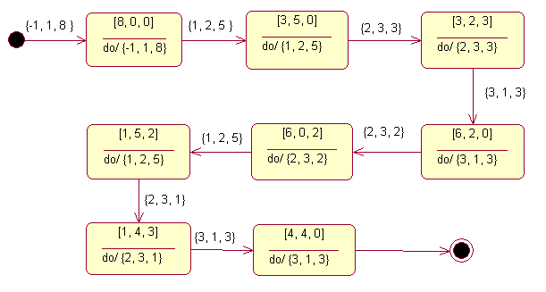

# 用三个水桶等分 8 升水的问题
```
题目：有三个分别是 3 升、5 升和 8 升容积的水桶，其中容积为 8 升的水桶中装满了水，容积为 3 升和容积为 5 升的水桶是空的，三个水桶都没有体积刻度。现在需要把大水桶中的 8 升水等分成两份，每份都是 4 升水，附加条件是只能使用这 8 升水和另外两个空水桶，不能借助其他容器或更多的水。
```

穷举法设计算法的两个步骤：
* 确定问题的解（或状态）的定义，解空间的范围以及正确解的判定条件；
* 根据解空间的特点选择搜索策略，逐个检验解空间中的候选解是否正确，必要时可辅助一些剪枝算法，排除一些明显不可能是正确解的检验过程，提高穷举的效率

## 定义问题的状态

把某一时刻三个水桶中的水量视为一个状态，将倒水动作的变化转化为三个水桶中水的状态的变化，问题的解空间就是水桶状态的全部集合，正确解的判定条件就是容量为 8 升的水桶和容量为 5 升的水桶中各有 4 升水。如果用一个三元组（或是三维向量）分别表示 8 升、5 升和 3 升水桶中的水量，则问题的初始状态就是 [8，0，0]，问题的解决状态就是 [4，4，0]。

算法本质上就是对状态的穷举搜索，这样的状态变化搜索的结果通常是得到一棵状态搜索树，根节点是初始状态，叶子节点可能是最终状态，也可能是某个无法转换到最终状态的中间状态，状态树有多少个最终状态的叶子节点，就有多少种答案。由此可知，解决本问题的算法关键是建立状态和动作的数据模型，并找到一种持续驱动动作产生的搜索方法。

## 状态树和解空间
倒水动作与静止状态的结合就产生了状态变化，持续的状态变化就产生了一棵状态树，这个状态树上的所有状态就构成了穷举算法的解空间


[8，0，0] 是状态树的根，图（1）只画出了这棵状态树的一部分，图中深颜色背景标识出的几个状态是状态树的一个分支，也是一个正确的解的状态转换路径。根据题目的意图，最终的结果是要输出这条转换路径的倒水过程，实际上就是与状态转换路径相对应的动作路径，或动作列表（图（1）中蓝色文字描述的倒水动作序列）。当定义了动作的数学模型后，就可以根据状态图中状态转换路径找到对应的动作列表，依次输出这个路径上每个状态对应的动作就可以得到一个完整的倒水过程。

### 状态的数据模型

以桶为单位，把容积和水量一起考虑
```
class Bucket
{
    ......
    int m_water;  //当前水量
    int m_capicity;  //桶的容积
};
```
表示三个水桶的三维向量用数组表示，`std::vector<...> `是 C++ 的数组，其类型就是前面定义的 Bucket。水的状态就是桶的状态：
```
class BucketsState
{
......
    std::vector<Bucket> m_buckets;  //桶的向量
    ACTION m_curAction;  //当前状态对应的动作
};
```
`m_curAction` 是当前状态绑定的倒水动作，即前一个状态通过这个倒水动作演变成当前状态，它并不是状态穷举过程中的关键属性，记录这个状态对应的倒水动作的目的是为了能够在输出结果时，除了输出三个水桶的状态变化序列，还能够输出对应的倒水动作

### 倒水动作的数据模型
一个合法的倒水动作包含三个要素：源水桶编号、目的水桶的编号和倒水的量（体积）。我们用一个三元组来描述倒水动作：{from, to, water}，from 是指源水桶的编号，to 是指目的水桶的编号，water 是此次倒水动作所倒的水量。倒水动作的数据结构定义如下：

```
typedef struct
{
    int from;
    int to;
    int water;
}ACTION;
```


## 设计搜索算法
本问题的解空间是一棵状态树，因此遍历搜索的算法就是树的遍历算法。状态树最初只有一个根节点，整棵树的展开是随着搜索算法逐步展开的。

**广度优先搜索** 的 *优点* 是不会因为状态的重复出现而导致搜索时出现状态环路，*缺点* 是需要比较多的存储空间记录中间状态。

**深度优先搜索** 的 *优点* 是在同一时间只需要存储从根节点到当前搜索状态节点这一条路径上的状态节点，需要的存储空间比较小，*缺点* 是对搜索过程中因出现重复状态导致的状态环路要做特殊处理，避免因状态搜索时出现死循环的情况。

态树的搜索就是对整个状态树进行遍历，这中间其实暗含了状态的生成，因为状态树一开始并不完整，只有一个初始状态的根节点，当搜索（也就是遍历）操作完成时，状态树才完整。就本题而言，要求解所有可能的等分水的方法，暗含了要记录从初始状态到最终状态，所以更适合使用 **深度优先遍历算法** 。

### 状态树的遍历
状态树遍历的关键是找到三个水桶之间所有合法的倒水动作，用这些倒水动作分别“生成”各自相应的新状态。

遍历三个水桶的所有可能倒水动作，就是对三个水桶任取两个进行全排列，这种排列的结果可以得到 6 种水桶的排列关系，

实际上，三个水桶就只有 6 个固定的倒水动作，分别是：1→2、1→3、2→1、2→3、3→1 和 3→2，我们可以用一个一维表来存储这 6 个动作，算法处理时直接遍历这个一维表就可以枚举全部倒水动作。这和本课程基础部分介绍的方向遍历的思想类似，是一种一致性处理方法。

### 剪枝和优化（重复状态判断）
采用深度优先搜索状态树，会遇到重复的状态而导致的状态环路。比如，假设某一时刻从 1 号桶倒 3 升水到 3 号桶，下一个时刻又从 3 号桶倒 3 升水到 1 号桶，此时水桶的状态就又回到了之前的状态，这就形成了一个状态环路。有时候状态环路可能复杂一点，几个状态之后才出现重复状态，图（1）就展示了一种复杂一点的状态环路。在状态 [3，5，0]→[3，2，3]→[6，2，0]→[3，5，0] 的转换过程中，[3，5，0] 状态再次出现形成状态环路。如果对这种情况不做处理，状态搜索就会在某个状态树分支陷入死循环，永远无法到达正确的结果状态。除此之外，如果对一个状态树分支上的某个状态经过搜索，其结果已经知道，则在另一个状态树分支上搜索时再遇到这个状态时，可以直接给出结果，或跳过搜索，以便提高搜索算法的效率。在这个过程中因重复出现被放弃或跳过的状态，可以理解为另一种形式的“剪枝”，可以使一次深度优先遍历很快收敛到初始状态，从图（1）可以看出来，这样重复出现的状态还是很普遍的情况。

需要对当前深度遍历过程中经过的搜索路径上的所有已经搜索过的状态做一个记录，形成一个当前正在处理的状态序列表。考虑到算法实现过程中，这个表要在其中的一端进行频繁的插入和删除操作

动作组合生成新状态时，都检查一下是否在这个记录中有状态相同的记录，如果存在状态相同的记录则跳过这个新状态，回溯到上一步继续处理下一个状态。如果新状态是状态表中没有的状态，则将新状态加入到状态表，然后从新状态开始继续深度优先遍历。

## 代码实现 思路
### 搜索算法代码
SearchState() 函数实现状态树的搜索遍历，是整个算法的核心。SearchState() 函数每次都是处理 state 队列中最后加入的那个状态（通过 states.back() 得到），将其视为当前状态。对这个当前状态的处理有两部分内容组成

`第一部分 IsFinalState() 函数判断当前状态序列中最后一个状态是否就是最终结果状态，如果是就输出一组状态序列（以及对应的倒水动作）；如果当前状态序列中最后一个状态不是结果状态，则转入第二部分开始搜索新的状态。搜索新状态的方法是遍历 action_table 表，尝试从 first 指定的水桶向 second 指定的水桶倒水，如果 TakeAction() 返回成功，说明倒水动作成立，可以通过本次倒水动作产生一个新状态（记录在 next 中）。然后对 next 进行检查，判断其是否是 states 队列中已经处理过的状态，如果 states 队列中已经存在这个状态，则不记录这个状态，继续对下一个动作进行尝试。如果 next 是个新状态，则将其加入到 states 队列中，并通过递归调用 SearchState() 函数实现深度优先遍历。`

### 倒水动作代码
现细节，能倒水的前提是 from 对应的桶中有水且 to 对应的桶中还有空间。具体能倒多少水由 from 中的水和 to 中的空间共同决定，最后在返回新状态 next 之前，把产生的倒水动作记录到 next 中。
## 总结

状态是静态的，需要一个“动作”才能完成状态的转换，产生新的状态。因此遍历算法实际上不是直接对状态进行遍历，而是对“**动作**”进行遍历，，然后将动作与状态叠加，从而产生新的状态。

三重点：

* 通过循环处理 action_table 表实现对动作的遍历
* 状态搜索的主体算法实现 SearchState() 函数，这里用了递归实现方式，利用 C++ 的 std::queue 队列提供的 push() 和 pop() 接口实现了状态的深度优先搜索和回溯
* 水动作 TakeAction() 函数，它实现了对倒水过程中出现的两种情况的处理，即能不能倒水、能倒多少水，同时还记录了此次倒水产生的 ACTION。

