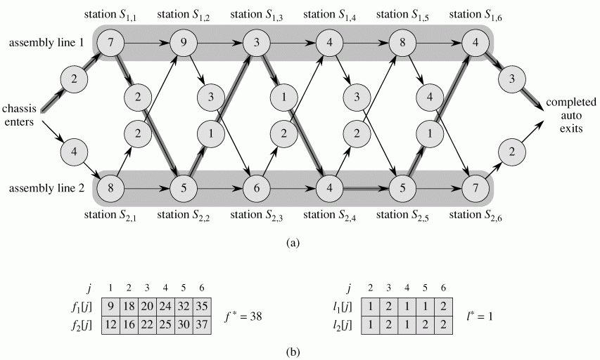

# 装配线与工作站问题（穷举）
## 算法分析

题目：
汽车公司在有两条装配线的工厂内生产汽车，一个汽车底盘在进入每一条装配线后，在每个工作站会在汽车底盘上安装不同的部件，最后完成的汽车从装配线的末端离开

每一条装配线上有 n 个工作站，编号为 j=1、2、…、n，把装配线 i（i 为 1 或 2）的第 j 个工作站表示为 S(i，j)。装配线 1 的第 j 个工作站 S(1，j) 和装配线 2 的第 j 个工作站 S(2，j) 执行相同的功能，然而这些工作站是在不同的时间建造的，并且采用了不同的技术，因此，每个工作站上完成装配所需要的时间也不相同，即使是在两条装配线相同位置的工作站也是这样。把每个工作站上所需要的装配时间记为 a(i，j)，并且，底盘进入装配线 i 需要的时间为 e(i)，离开装配线 i 需要的时间是 x(i)。正常情况下，底盘从一条装配线的上一个工作站移到下一个工作站所花费的时间可以忽略，但是偶尔也会将未完成的底盘从一条装配线的一个工作站移到另一条装配线的下一个工作站，比如遇到紧急订单的时候。假设将已经通过工作站 S(i，j) 的底盘从装配线 i 移走所花费的时间为 t(i，j)，现在的问题是要确定在装配线 1 内选择哪些工作站以及在装配线 2 内选择哪些工作站，以使汽车通过工厂的总时间最小，如图（2）所示，最快的时间是选择装配线1的 1、3 和 6 号工作站以及装配线 2 的 2、4 和 5 号工作站。

`简单理解一下这个题目的意思就是汽车底盘选择一条装配线，期间不能更换，从第一个工作站移动到最后一个工作站，即可完成安装，但是根据对题目的理解，这样所花费的时间肯定不是最短的。如果另一条装配线上的某个工作站效率比较高，那么装配到这一步的时候，换到那条装配线上进行装配肯定会节省时间，但是考虑到从一条装配线移动到另一条装配线也需要花费时间，那就要综合考虑了。“移”还是“不移”？这是个问题。`

