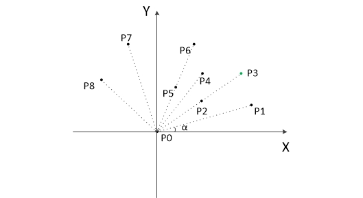

简单难度 为简单数组结构,以及基础算法方法的使用

中等难度 为复杂数据结构(图,树),或者基础算法的混合使用

困难难度 多为复杂数据结构和高难度算法的混合使用,以及需要较强的分析能力

## 未学会的新算法

**Dijkstra 算法**[743](./algorithm/743-network-delay-time.js)

**拓扑排序 算法** (851)

**拒绝采样 算法**

**字典树**[208. 实现 Trie (前缀树) 的官方题解](https://leetcode-cn.com/problems/implement-trie-prefix-tree/solution/shi-xian-trie-qian-zhui-shu-by-leetcode-ti500/)

**摩尔投票法**

**牛顿迭代法**

**Knuth-Shuffle 洗牌算法**

**优先队列**

**后缀数组** (1044)

**蓄水池抽样算法**

**线段树**

**凸包算法**

[382题](.\algorithm\382-linked-list-random-node.js)

## 算法分析

### 后缀数组

后缀数组是后缀树的一种变种,能够节省空间.构造的方法有「**倍增算法**」,「**DC3算法**」

#### 主要思想

设字符串为S(1-n)由n个字符组成,则字符串有n个相同后缀的子串.分别为s(1-n),s(2-n),...,s(n-n).

然后构建SAs数组,每个数组存储这些后缀的子串,存储后进行字典序排序.

最后构造出一个 height 数组,表示SA数组每个元素和前一个元素相同前缀的字符个数

### 优先队列

大顶堆,小顶堆

### 凸包算法
概念

计算几何（图形学）中的概念
在一个实数向量空间V中，对于给定集合X,所有包含X的凸集的交集S被称为凸包

X的凸包可以用X内所有点（X1,......Xn）的线性组合来构造

在二维欧几里得空间中，凸包可想象为一条刚好包着所有点的橡皮圈

#### Graham 扫描法

思路： Graham 扫描的思想是先找到凸包上的一个点，然后从那个点开始按逆时针方向逐个找凸包的点，实际上就是进行极角排序，然后对其查询使用

步骤：

1. 把所有点放在二维坐标系中，则纵坐标最小的点一定是凸包上的点,如P0
2. 把所有点的坐标平移一下，使P0作为原点，如上图
3. 计算各个点相对于 P0 的辐角 α，按从小到大的顺序对各个点排序，当 α相同时，距离 P0 比较近的排在前面。（由几何知识可知，第一个点与最后一个点一定是凸包上的点）
   （以上是准备步骤）以上，已经知道了凸包上的而第一个点 P0 和第二个点 P1,把他们放在栈里面。现在从步骤3 求得的哪个结果里，把 P1 后面的那个点拿出来做当前点，即 P2 接下来找第三个点
4. 连接 P0 和栈顶的那个点，得到直线L.看当前点是在直线L的右边还是左边。如果在直线的右边就执行步骤5，如果在直线上，或者在直线左边就执行步骤6
5. 如果在右边，则栈顶的那个元素不是凸包上的点，把栈顶元素出栈。执行步骤4
6. 当前点是凸包上的点，把它压入栈，执行步骤7
7. 检查当前的点P2是不是步骤3那个结果的最后一个元素。是最后一个元素的话就结束。如果不是的话就把P2后面那个点做当前点。返回步骤4

